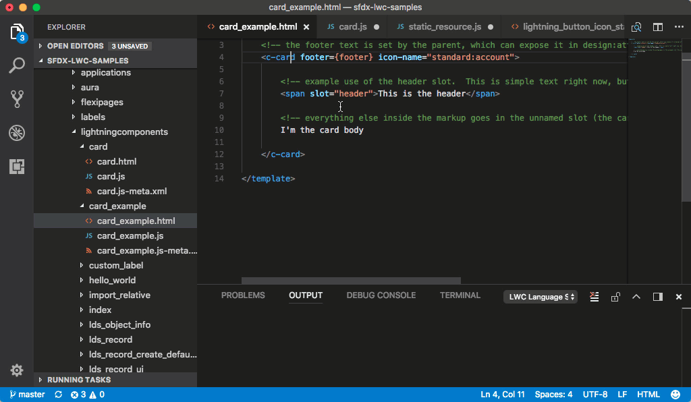

# salesforcedx-vscode-lwc

View sample Lightning web component apps, see code-completion suggestions, hover for context-sensitive help, and find syntactic errors in your code. This extension is powered by the Lightning Web Components Language Server.

For the best results, use this extension with the other extensions in the [salesforcedx-vscode](https://marketplace.visualstudio.com/items?itemName=salesforce.salesforcedx-vscode) bundle.  

## Lightning Web Components is a Pilot Feature

We provide this extension to selected customers through a pilot program that requires agreement to specific terms and conditions. The Lightning Web Components Visual Studio Code extension is subject to change and isn’t generally available unless or until Salesforce announces its general availability in documentation or in press releases or public statements. We can’t guarantee general availability within any particular time frame or at all. Make your purchase decisions only on the basis of generally available products and features.

##  Prerequisites

* Before you set up this extension, make sure that you have [Visual Studio Code](https://code.visualstudio.com/download) v1.17 or later.  
* Before you install this extension, install the [Salesforce DX extension](https://marketplace.visualstudio.com/items?itemName=salesforce.salesforcedx-vscode).

## Installation

1. Install the Lightning Web Components extension from the Visual Studio Marketplace: <https://marketplace.visualstudio.com/items?itemName=salesforce.salesforcedx-vscode-lwc>

1. Open your Salesforce DX project in a directory that contains an `sfdx-project.json` file. Otherwise, some features don’t work.

## Features Provided by This Extension

* Notification of HTML and JavaScript file errors or compiler warnings

* Configures ESLint for Lightning web components
    * Errors and warnings appear in Javascript files
    * Hover over code to display warning messages
    * Click the displayed message for available code actions
  
* Auto-completion for resources in JavaScript files
    * Static resources
    * Custom label imports
    * Lightning web components imports from `engine`

* Auto-completion for resources in HTML files
    * Tags and attributes for standard `lightning` namespace Lightning web components
    * Tags and attributes for custom `c` namespace Lightning web components
    * Lightning web components directives in related HTML files
  
* Help documentation when you hover over standard `lightning` namespace Lightning web components or attributes

* Click navigation from HTML files to the main JavaScript file for custom `c` namespace Lightning web components and attributes
  
## Configuration Modifications

This extension makes the following modifications to your Visual Studio Code environment and SFDX project.

* `jsconfig.json` file added in each `lightningcomponents` directory
* `.eslintrc.json` file added in each `lightningcomponents` directory
* `.forceIgnore` file updated for each file added to the `lightningcomponents` directory (such as `lightningcomponents/.eslintrc.json`) generated by the extension inside `packageDirectories` to ensure `force:source:push` continues to work
* The `typings` directory is populated inside the `.sfdx` directory (which is already in `.gitignore` per SalesforceDX guidelines)
* Additions to the `jsconfig.json` files are allowed and merged into the existing `jsconfig.json` file

## Resources

  * Trailhead: [Get Started with Salesforce DX](https://trailhead.salesforce.com/trails/sfdx_get_started)
  * _[Salesforce DX Developer Guide](https://developer.salesforce.com/docs/atlas.en-us.sfdx_dev.meta/sfdx_dev)_
  * GitHub: [salesforcedx-vscode-lightning](https://github.com/forcedotcom/salesforcedx-vscode/tree/develop/packages/salesforcedx-vscode-lightning)
  * [Lightning Web Components Examples](https://github.com/forcedotcom/sfdx-lwc-samples)
  * _Lightning Web Components Developer Guide,_ available as a PDF from the pilot coordinator

---
Currently, Visual Studio Code extensions are not signed or verified on the Microsoft Visual Studio Code Marketplace. Salesforce provides the Secure Hash Algorithm (SHA) of each extension that we publish. Consult [Manually Verify the salesforcedx-vscode Extensions’ Authenticity](https://developer.salesforce.com/media/vscode/SHA256.md) to learn how to verify the extensions.

---
